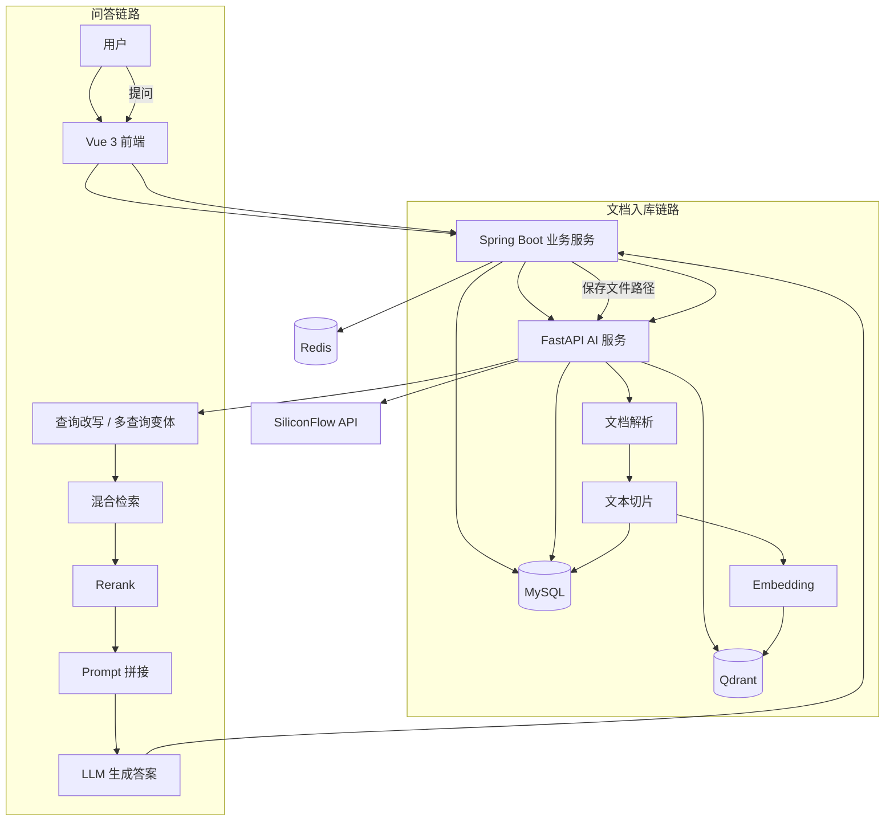

# 企业知识库智能助手

一个面向企业内部场景的 RAG 知识库问答平台，支持文档上传、解析、切片、向量化入库，以及基于知识库的智能问答、引用溯源、会话历史和反馈闭环。

适合作为 AI 应用 / RAG / 全栈项目展示，重点体现“从业务后台到 AI 检索问答链路”的完整落地能力。

## 项目亮点

- 完整 RAG 主链路：上传文档 -> 解析切片 -> Embedding -> Qdrant 检索 -> LLM 生成 -> 引用返回
- 前后端分离 + 双后端架构：Vue 3 前端、Spring Boot 业务服务、FastAPI AI 服务
- 企业权限模型：管理员 / 知识库所有者 / 成员三级权限，支持 `PUBLIC` / `PRIVATE`
- 检索质量优化：查询改写、多查询变体、混合检索、RRF 融合、Rerank 精排
- 可解释回答：答案支持引用编号、引用展开、跳转文档原文定位
- 反馈闭环：点赞点踩、失败问题自动记录、后台查看与处理
- 多轮对话：会话创建、历史保存、标题生成、上下文追问
- 工程化交付：MySQL、Redis、Qdrant、Docker Compose 一键部署

## 核心能力

### 1. 文档入库

- 支持 `PDF / DOCX / MD / TXT` 上传
- 解析后按固定窗口切片：`500` 字 + `50` overlap
- 调用 `BGE-M3` 生成向量
- 写入 `Qdrant` 保存向量，写入 `MySQL` 保存文档与 chunk 元数据

### 2. 智能问答

- 基于知识库范围过滤检索，避免跨库污染
- 支持非流式问答和 SSE 流式问答
- 保留引用来源、召回数量、模型信息
- 支持多轮历史上下文和追问场景

### 3. 引用与反馈

- 每条回答可返回引用文档、chunk 编号、页码、原文片段
- 前端支持点击引用展开内容并跳转文档详情
- 支持点赞 / 点踩、原因分类、失败问题自动沉淀

### 4. 后台管理

- 用户管理
- 知识库 CRUD 与成员管理
- 文档管理与处理状态查看
- 失败问题管理
- 管理员 / 普通用户双视角统计面板

## 系统架构



## 技术栈

| 层 | 技术 |
|---|---|
| 前端 | Vue 3 + Element Plus + Pinia + Vue Router + Vite |
| 业务后端 | Spring Boot 3.4 + MyBatis-Plus + JWT |
| AI 服务 | FastAPI + PyMuPDF + python-docx + httpx |
| 数据库 | MySQL 8.x |
| 缓存 | Redis |
| 向量库 | Qdrant |
| 模型平台 | SiliconFlow API |

## 项目结构

```text
kb-assistant/
├── frontend/                # Vue 3 前端（含 composables/ + components/chat/）
├── backend-java/            # Spring Boot 业务服务（含 constants/ + enums/）
├── backend-python/          # FastAPI AI 服务（含 siliconflow_client.py）
├── sql/                     # 建表脚本与初始化数据
├── docker/                  # Docker Compose 部署配置
├── docs/                    # 设计文档
└── data/files/              # 上传文件存储目录
```

更详细的目录说明见 [docs/项目目录结构说明.md](docs/项目目录结构说明.md)。

## 快速开始

### 环境要求

| 依赖 | 版本建议 |
|---|---|
| JDK | 21+ |
| Python | 3.10+ |
| Node.js | 18+ |
| MySQL | 8.x |
| Redis | 7.x |
| Qdrant | latest |

### 1. 初始化数据库

```bash
mysql -h localhost -u root -p < sql/init_schema.sql
```

默认管理员账号：

```text
admin / admin123
```

### 2. 配置 AI 服务环境变量

```bash
cp backend-python/.env.example backend-python/.env
```

至少需要补充：

```env
SILICONFLOW_API_KEY=your_api_key
CHAT_MODEL=deepseek-ai/DeepSeek-V4-Flash
EMBEDDING_MODEL=BAAI/bge-m3
```

### 3. 启动依赖服务

```bash
docker run -d --name kb-mysql -e MYSQL_ROOT_PASSWORD=root -e MYSQL_DATABASE=knowledge_base_assistant -p 3306:3306 mysql:8.0
docker run -d --name kb-redis -p 6379:6379 redis:7-alpine
docker run -d --name kb-qdrant -p 6333:6333 -p 6334:6334 qdrant/qdrant
```

### 4. 启动项目

```bash
# 前端
cd frontend
npm install
npm run dev
```

```bash
# Spring Boot
cd backend-java
mvn spring-boot:run -Dspring-boot.run.profiles=dev
```

```bash
# FastAPI
cd backend-python
python -m uvicorn app.main:app --reload --host 0.0.0.0 --port 8000
```

访问地址：

- 前端：`http://localhost:3000`
- Spring Boot：`http://localhost:8080`
- FastAPI：`http://localhost:8000`

## Docker 部署

项目支持 Docker Compose 一键启动：

```bash
cd docker
docker-compose up -d
```

常用命令：

```bash
docker-compose logs -f
docker-compose down
```

## 演示建议

仓库内提供了测试文档：

- [docs/test-kb/README.md](docs/test-kb/README.md)
- `docs/test-kb/员工手册_考勤与办公规范.md`
- `docs/test-kb/人事制度_请假管理.md`
- `docs/test-kb/行政制度_报销流程.txt`

可上传后测试以下问题：

- 我们上午几点上班？
- 午休时间有多久？
- 报销要在多少天内提交？
- 病假两天以上需要什么材料？

## API 概览

### Spring Boot 对外接口

| 模块 | 端点 | 说明 |
|---|---|---|
| 认证 | `POST /api/auth/login` | 登录 |
| 认证 | `GET /api/auth/me` | 获取当前用户 |
| 知识库 | `GET/POST/PUT/DELETE /api/knowledge-bases` | 知识库管理 |
| 成员 | `GET/POST/DELETE /api/knowledge-bases/{id}/members` | 成员管理 |
| 文档 | `GET/POST/DELETE /api/knowledge-bases/{id}/documents` | 文档管理 |
| 处理 | `POST /api/documents/{id}/process` | 触发文档处理 |
| 问答 | `POST /api/chat/ask` | 非流式问答 |
| 问答 | `POST /api/chat/ask-stream` | SSE 流式问答 |
| 会话 | `POST /api/chat/sessions` | 创建会话 |
| 反馈 | `POST /api/feedback` | 点赞 / 点踩 |

### FastAPI 内部接口

| 端点 | 说明 |
|---|---|
| `POST /internal/document/process` | 文档处理 |
| `POST /internal/chat/ask` | 非流式问答 |
| `POST /internal/chat/ask-stream` | 流式问答 |
| `GET /health` | 健康检查 |

## 开发状态

- [x] 登录鉴权与角色管理
- [x] 知识库 CRUD 与成员权限
- [x] 文档上传、解析、切片、向量化
- [x] Qdrant 向量检索
- [x] 混合检索 + Rerank
- [x] 流式 / 非流式问答
- [x] 引用溯源与原文跳转
- [x] 多轮会话历史
- [x] 点赞点踩与失败问题闭环
- [x] 统计面板
- [x] Docker Compose 部署
- [ ] 单元测试覆盖补齐

## 适合面试重点讲的点

- 为什么采用 `Spring Boot + FastAPI` 双后端拆分，而不是全放在一个服务里
- 为什么 RAG 不能只做向量检索，还需要关键词召回、RRF 和 Rerank
- 如何设计引用溯源，让答案“可解释、可追踪”
- 如何把用户反馈沉淀成失败问题，用于后续优化知识库
- 如何做知识库级别的权限隔离，避免不同业务文档互相污染

## 相关文档

- [docs/系统设计文档.md](docs/系统设计文档.md)
- [docs/数据库设计文档.md](docs/数据库设计文档.md)

