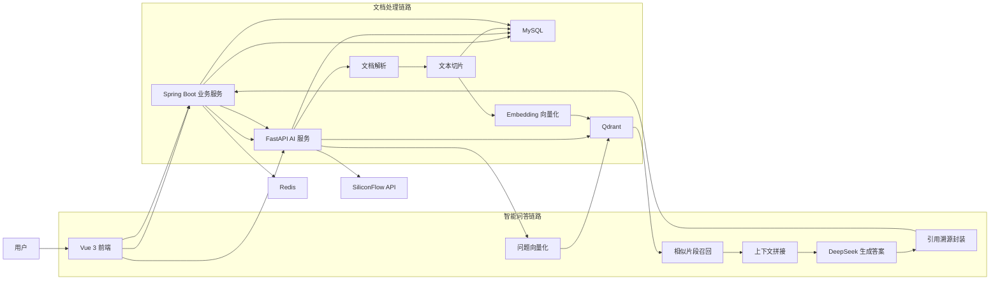
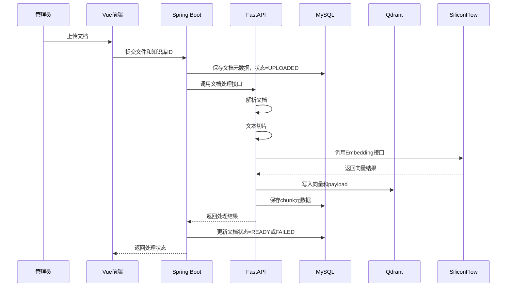
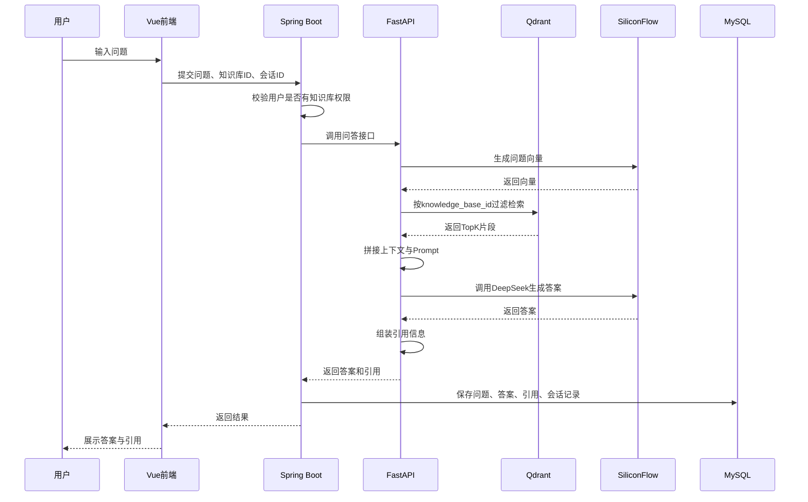
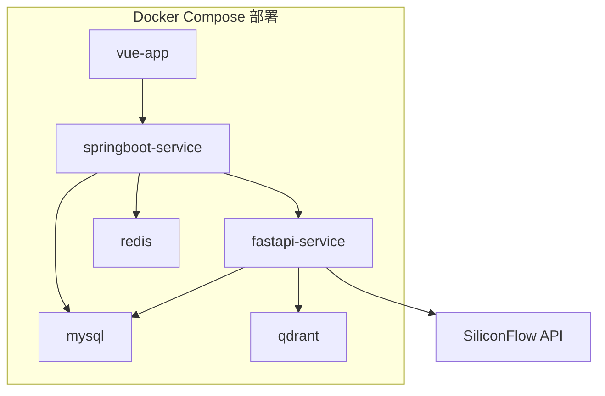

# 企业知识库智能助手系统设计文档 V1

## 1. 文档说明

本文档用于描述《企业知识库智能助手》的系统总体设计方案，明确系统架构、模块划分、服务职责、核心业务流程、数据流转方式、部署方案及扩展方向，为后续开发、测试和部署提供依据。

## 2. 系统目标

系统面向企业内部知识管理与智能问答场景，围绕“文档入库”和“知识问答”两条主链路进行建设，达到以下目标：

- 支持企业文档集中管理与授权访问
- 支持多格式文档解析、切片、向量化与知识入库
- 支持基于知识库的智能问答
- 支持引用溯源，提升答案可解释性
- 支持反馈和失败问题记录，形成优化闭环
- 支持本地一键部署和项目演示

## 3. 总体架构

## 4. 技术架构设计

### 4.1 前端层

技术：`Vue 3`

职责：

- 提供登录、知识库管理、文档管理、问答、会话历史、反馈等页面
- 调用 Spring Boot 提供的业务接口
- 展示问答结果与引用来源
- 承担基础交互控制和页面权限控制

设计原则：

- 前端只负责页面展示和交互，不承载核心业务逻辑
- 权限校验以前端控制加后端强校验双重实现
- 问答页与管理页分离，保持界面清晰

### 4.2 业务服务层

技术：`Spring Boot`

职责：

- 用户认证与授权
- 用户、角色、知识库、成员、文档元数据管理
- 会话历史、反馈、失败问题、统计信息管理
- 统一对外提供 REST API
- 调用 FastAPI 完成文档处理和问答编排

设计原则：

- 所有业务主数据由 Spring Boot 维护
- 所有权限判断由 Spring Boot 负责
- 对 AI 服务的调用通过内部接口进行解耦

### 4.3 AI 服务层

技术：`FastAPI`

职责：

- 文档解析
- 文本切片
- Embedding 向量化
- 向量写入与检索
- Prompt 上下文拼接
- 调用 DeepSeek 生成答案
- 返回引用结果和检索依据

设计原则：

- AI 链路独立，便于后续替换模型或优化检索策略
- 与 Spring Boot 通过 HTTP 接口通信
- 所有知识库问答逻辑集中在 AI 服务中统一实现

### 4.4 数据存储层

- `MySQL`：存业务数据和结构化元数据
- `Redis`：存登录态、缓存、热点数据、任务状态
- `Qdrant`：存向量和检索 payload

## 5. 模块设计

### 5.1 用户与认证模块

功能职责：

- 用户登录
- Token 签发与校验
- 用户状态管理
- 角色识别

输入：

- 用户名
- 密码

输出：

- Token
- 用户信息
- 角色信息

设计说明：

- 登录成功后签发 JWT 或 Session Token
- Redis 可用于存储登录态和过期控制
- 接口访问时统一进行身份校验

### 5.2 权限控制模块

功能职责：

- 管理员与普通用户角色隔离
- 知识库成员访问控制
- 接口级权限校验

设计说明：

- 管理员拥有全局管理权限
- 普通用户只能访问自己加入的知识库
- 问答前必须校验用户是否属于该知识库成员

权限规则：

- 用户管理、知识库创建、成员管理、文档上传仅管理员可执行
- 问答和会话查看仅限已授权用户

### 5.3 知识库管理模块

功能职责：

- 创建知识库
- 修改知识库
- 删除知识库
- 查看知识库列表和详情

设计说明：

- 知识库是系统中的核心业务实体
- 每个文档必须归属一个知识库
- 后续所有检索都基于知识库维度过滤

### 5.4 成员管理模块

功能职责：

- 为知识库添加成员
- 移除成员
- 查看成员列表

设计说明：

- 采用“指定成员可见”模式
- 用户与知识库为多对多关系
- 成员关系表作为权限判断依据

### 5.5 文档管理模块

功能职责：

- 上传文档
- 查看文档列表
- 查看处理状态
- 删除文档
- 查看处理结果摘要

设计说明：

- 文档上传由 Spring Boot 接收后保存文件
- 保存文档记录后，调用 FastAPI 进行解析和入库
- 文档状态流转需要明确
- **文件命名策略**：为避免同名文件冲突，上传时使用 `{UUID}_{原始文件名}` 格式保存，原始文件名保留在元数据中用于展示

建议状态：

- `UPLOADED`
- `PARSING`
- `CHUNKING`
- `EMBEDDING`
- `READY`
- `FAILED`

### 5.6 文档解析模块

功能职责：

- 根据文件类型提取文本
- 保留标题、段落、页码等结构信息
- 输出标准化文本结构

设计说明：

- PDF：优先保留页码映射
- DOCX：提取段落结构
- Markdown：保留标题层级
- TXT：按自然段切分

输出结构建议：

- `document_id`
- `section_title`
- `page_no`
- `raw_text`

### 5.7 切片模块

功能职责：

- 将长文本切成适合向量检索的 chunk
- 保留 chunk 与原文档的映射关系

设计说明：

- 优先按标题、段落切片
- 每个 chunk 保持适中长度
- 保留 chunk overlap，降低语义断裂

输出字段建议：

- `chunk_id`
- `document_id`
- `knowledge_base_id`
- `chunk_index`
- `content`
- `page_no`
- `token_count`

### 5.8 向量化模块

功能职责：

- 对 chunk 生成 embedding
- 将向量与元数据写入 Qdrant

设计说明：

- 向量模型建议使用 `BAAI/bge-m3`
- embedding 输入为 chunk 文本
- 每条向量记录必须附带 payload，便于过滤和溯源

Qdrant payload 建议字段：

- `knowledge_base_id`
- `document_id`
- `chunk_id`
- `chunk_index`
- `file_name`
- `page_no`
- `content_preview`

### 5.9 检索模块

功能职责：

- 对用户问题生成查询向量
- 在指定知识库中进行相似度搜索
- 返回 TopK 候选片段

设计说明：

- 检索前必须按知识库 ID 过滤
- 检索结果应带相似度分数
- TopK 建议先从 `3-5` 开始

输出内容：

- chunk 内容
- 相似度分数
- 文档名
- 页码
- chunk 序号

### 5.10 问答生成模块

功能职责：

- 将问题与召回上下文拼接成 Prompt
- 调用 DeepSeek 生成最终答案
- 控制回答风格与边界

设计说明：

- 要求模型优先基于检索内容回答
- 若上下文不足，明确提示无法确认
- 减少自由发挥，降低幻觉风险

Prompt 约束建议：

- 只依据提供的知识片段作答
- 不得编造未出现的信息
- 若证据不足，直接说明未检索到相关内容
- 尽量输出简明、结构化答案

### 5.11 引用溯源模块

功能职责：

- 将模型使用的依据片段封装成引用信息
- 返回前端展示

设计说明：

- 每条引用至少包含文件名和片段序号
- 如果存在页码，则优先返回页码
- 引用信息来自实际召回结果，不能凭空生成

返回结构建议：

- `file_name`
- `page_no`
- `chunk_index`
- `content_preview`

### 5.12 会话管理模块

功能职责：

- 记录问答过程
- 保存历史消息
- 支持多轮对话展示

设计说明：

- 每次进入问答页可新建会话
- 同一会话下记录用户问题和系统回答
- 会话标题可由首个问题生成

### 5.13 反馈与失败问题模块

功能职责：

- 收集用户对答案的评价
- 自动沉淀失败案例
- 支持后续优化分析

设计说明：

- 点赞和点踩均记录
- 点踩可附原因
- 未检索到内容时自动进入失败问题记录

失败问题分类建议：

- `NO_HIT`：无检索结果
- `LOW_QUALITY`：回答质量差
- `INSUFFICIENT_CITATION`：引用不足
- `MODEL_ERROR`：模型调用异常

### 5.14 统计模块

功能职责：

- 提供基础运营数据
- 支持管理员快速了解系统使用情况

V1 统计项：

- 用户数
- 知识库数
- 文档数
- 已入库文档数
- 问答次数
- 反馈次数
- 失败问题数

## 6. 核心流程设计

### 6.1 文档入库流程

流程说明：

1. 管理员上传文件并指定归属知识库
2. Spring Boot 保存文档基础信息
3. 调用 FastAPI 执行解析、切片、向量化
4. 向量写入 Qdrant，chunk 元数据写入 MySQL
5. 处理完成后更新文档状态

### 6.2 智能问答流程

流程说明：

1. 用户在已授权知识库中提问
2. Spring Boot 校验权限
3. FastAPI 完成检索和生成
4. 返回答案及引用
5. Spring Boot 保存会话与问答记录

## 7. 服务间接口设计

### 7.1 Spring Boot 对 FastAPI 的调用接口

1. 文档处理接口  
   `POST /internal/document/process`

请求参数：

- `documentId`
- `knowledgeBaseId`
- `filePath`
- `fileName`
- `fileType`

返回参数：

- `success`
- `status`
- `chunkCount`
- `message`

2. 问答接口  
   `POST /internal/chat/ask`

请求参数：

- `userId`
- `knowledgeBaseId`
- `sessionId`
- `question`

返回参数：

- `answer`
- `citations`
- `retrievalCount`
- `modelName`
- `success`

### 7.2 前端对 Spring Boot 的核心接口

- `POST /api/auth/login`
- `GET /api/user/me`
- `GET /api/knowledge-bases`
- `POST /api/knowledge-bases`
- `POST /api/knowledge-bases/{id}/members`
- `GET /api/knowledge-bases/{id}/documents`
- `POST /api/documents/upload`
- `POST /api/chat/ask`
- `GET /api/chat/sessions`
- `GET /api/chat/sessions/{id}/messages`
- `POST /api/feedback`
- `GET /api/failed-questions`
- `GET /api/dashboard/statistics`

## 8. 数据设计原则

### 8.1 MySQL 存储内容

适合存储：

- 用户信息
- 角色信息
- 知识库信息
- 成员关系
- 文档元数据
- chunk 元数据
- 会话记录
- 消息记录
- 反馈记录
- 失败问题记录

原因：

- 结构化关系清晰
- 便于分页、筛选、统计
- 便于和业务权限关联

### 8.2 Qdrant 存储内容

适合存储：

- chunk 向量
- 与向量关联的 payload 元数据

原因：

- 适合相似度搜索
- 支持条件过滤
- 支持知识库范围检索

### 8.3 Redis 存储内容

适合存储：

- 登录态缓存
- 热点问题缓存
- 文档处理状态缓存
- 临时会话状态

原因：

- 读写速度快
- 适合高频短期数据

## 9. 部署设计

容器建议：

- `frontend`
- `springboot-service`
- `fastapi-service`
- `mysql`
- `redis`
- `qdrant`

部署说明：

- 前后端分离部署
- Spring Boot 与 FastAPI 通过内部网络通信
- MySQL、Redis、Qdrant 作为基础依赖服务
- SiliconFlow 为外部模型服务接口

## 10. 异常处理设计

文档处理异常：

- 文件格式不支持
- 文档解析失败
- embedding 调用失败
- 向量写入失败

处理策略：

- 记录错误日志
- 更新文档状态为 `FAILED`
- 返回明确失败原因

问答异常：

- 用户无权限
- 知识库不存在
- 向量检索为空
- 大模型调用失败

处理策略：

- 无权限直接拒绝
- 无检索结果时提示未找到相关内容
- 大模型异常时提示系统繁忙
- 失败问答写入失败问题记录

## 11. 安全设计

- 登录接口进行密码校验
- 所有业务接口要求携带 Token
- 后端进行角色和知识库成员双重校验
- 文件上传限制格式与大小
- 服务间内部接口可加签名或内网访问限制
- 敏感配置如 API Key 使用环境变量管理

## 12. 性能与扩展设计

当前版本：

- 单知识库检索
- 同步文档处理
- 基础向量召回

后续扩展方向：

- 增加异步任务队列，提高文档入库效率
- 增加 rerank，提高召回质量
- 增加混合检索，提高复杂查询效果
- 增加多模型切换
- 增加文档版本管理

## 13. 设计亮点总结

- 采用 `Spring Boot + FastAPI` 分层设计，业务与 AI 链路职责清晰
- 采用 `Qdrant` 实现知识库范围内的向量检索
- 基于 RAG 构建完整问答链路，支持引用溯源
- 引入反馈与失败问题记录，形成效果优化闭环
- 采用 Docker Compose 提升部署复现能力

## 14. 下一步建议

现在最顺的推进顺序是：

1. 写《数据库设计文档》
2. 写《接口设计文档》
3. 写《项目目录结构设计》
4. 再开始建表和搭后端骨架

